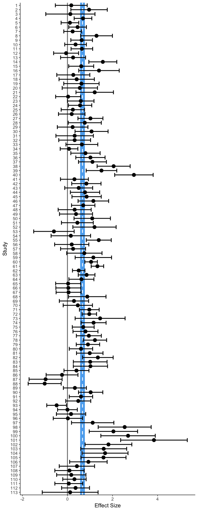
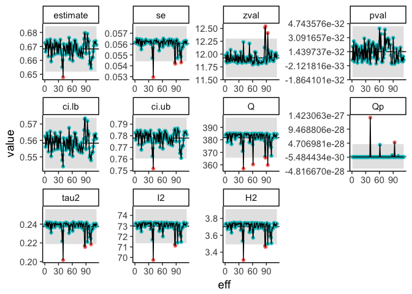
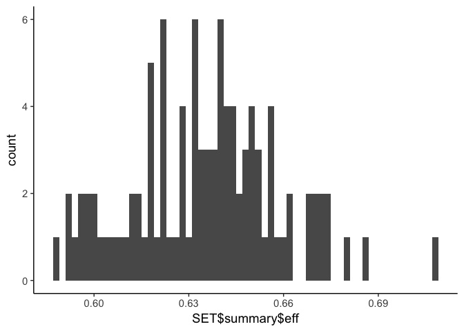
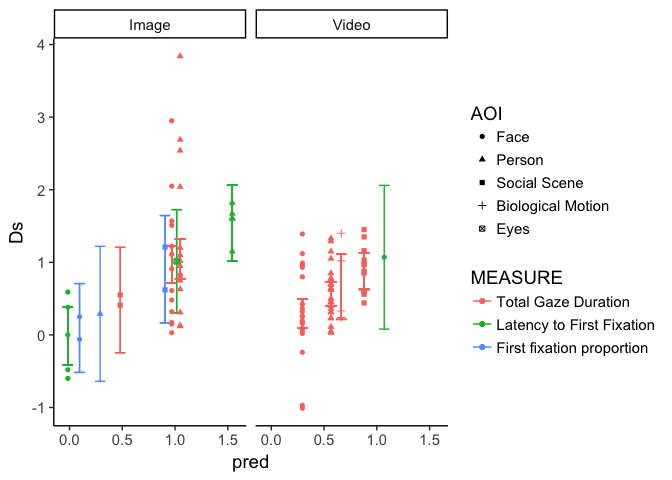
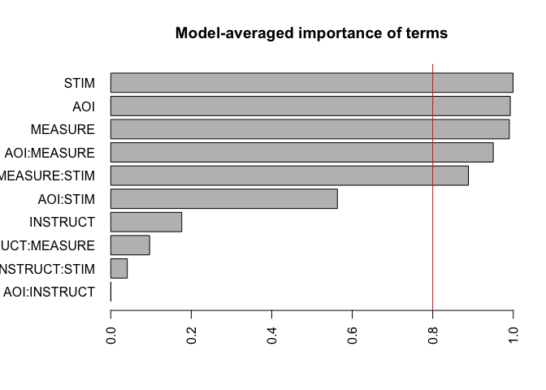
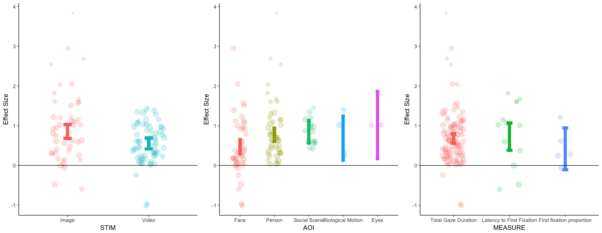
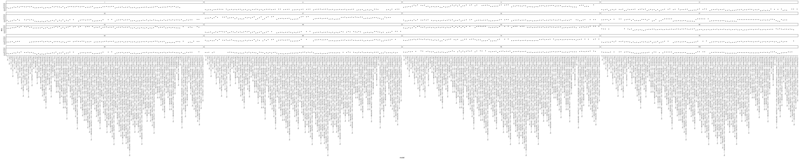

# Index

| Section | Description | Status |
| --- | --- | --- |
| [Data preparation](#prep) | Preparing the data | **Complete** |
| [Robustness checks](#robust) | Fit global model and check robustness | **Complete** |
| [Dependency checks](#depend) | Characterise the influence of dependency | **Complete** |
| [Model comparison](#model) | Find the model that best explains the data | *Incomplete* |

***


<a id='prep'></a>
# Load and prepare the data.


```r
setwd("/Users/nicholashedger/Documents/Meta_SM")
FILE=read.csv('Orienting.xlsx - Sheet1_pooled.csv')
head(FILE)
```

```
##                       NAME DATE N_ASD N_NT AGE_ASD    AGE_NT GEND_RAT_ASD
## 1              Amso et al  2014    15   15    3.53  3.730000         1.50
## 2              Bird et al  2011    13   13   40.50 32.800000         3.30
## 3         Birmingham et al 2011     9    5   31.60 32.600000         8.00
## 4   Chawarksa et al_dyadic 2012    54   48    1.80  1.708333         5.66
## 5 Chawarksa et al_sandwich 2012    54   48    1.80  1.708333         5.66
## 6    Chawarksa et al_joint 2012    54   48    1.80  1.708333         5.66
##   GEND_RAT_NT ADOS_TOT ADOS_SA AQ_ASD AQ_NT
## 1         1.5    21.80   18.47     NA    NA
## 2          NA    10.46      NA     NA    NA
## 3         5.0    13.90    8.30     NA    NA
## 4         2.7    20.06   15.90     NA    NA
## 5         2.7    20.06   15.90     NA    NA
## 6         2.7    20.06   15.90     NA    NA
##                                                   STIM_TYPE AUDIO STIM_DUR
## 1     IMAGE OFINDOOR AND OUTDOOR SCENES CONTAINING A PERSON     0     5.00
## 2                  VIDEO SOCIAL INTERACTION FROM SOAP OPERA     1    49.75
## 3                         IMAGE OF A PERSON IN WAITING ROOM     0    15.00
## 4                     VIDEO OF PERSON ENGAGING WIH OBSERVER     1    69.00
## 5                           VIDEO OF PERSON MAKING SANDWICH     1    63.00
## 6 VIDEO OF PERSON LOOKING AT CAMERA AND THEN TURNING TO TOY     1    30.00
##   INSTRUCT MEASURE               AOI AOIn METHOD M_SOC_ASD SD_SOC_ASD
## 1        1       1      FACEvNONFACE    1      1     25.00      11.62
## 2        1       1      FACEVNONFACE    1      1      0.45       0.13
## 3        4       1 PERSONvBACKGROUND    2      1     56.77      15.91
## 4        2       1 PERSONvBACKGROUND    2      1     63.00      17.98
## 5        1       1 PERSONvBACKGROUND    2      1     64.90      21.78
## 6        6       1 PERSONvBACKGROUND    2      1     80.90      10.68
##   M_SOC_NT SD_SOC_TD Pool  p  t  d dir  F Flag ISNEW
## 1    27.00     11.62    1 NA NA NA  NA NA    0     0
## 2     0.55      0.07    2 NA NA NA  NA NA    0     0
## 3    58.83     16.42    3 NA NA NA  NA NA    0     0
## 4    73.50     11.14    4 NA NA NA  NA NA    0     0
## 5    66.90     14.09    4 NA NA NA  NA NA    0     0
## 6    85.10      7.54    4 NA NA NA  NA NA    0     0
```


```r
library(compute.es)
```

Function for computing the variance of d. 


```r
variance_d=function(n1,n2,d){
  var=(n1+n2)/ (n1*n2)+ (d^2)/ (2*(n1+n2))
  return(var)
}
```

Make a couple of preparations to the data. Firstly, remove the data that have been flagged. Also, make sure that there are no NAs in the 'direction' field.


```r
FILE=FILE[FILE$Flag==0,]
FILE$dir[is.na(FILE$dir)] <- 100
```

Now loop through the entire file and calculate the effect sizes and standard errors.


```r
FILE$Ds=rep(0,nrow(FILE))
FILE$SE=rep(0,nrow(FILE))


# Method 1 - means and SD's
for (i in 1:nrow(FILE)){
  if (FILE$METHOD[i]==1 && FILE$dir[i]==1){
    
    # Means and SD's
    FILE$Ds[i]=abs(mes(FILE$M_SOC_NT[i],FILE$M_SOC_ASD[i],FILE$SD_SOC_TD[i],FILE$SD_SOC_ASD[i],FILE$N_NT[i],FILE$N_ASD[i],verbose=FALSE)$d)
    FILE$SE[i]=sqrt(mes(FILE$M_SOC_NT[i],FILE$M_SOC_ASD[i],FILE$SD_SOC_TD[i],FILE$SD_SOC_ASD[i],FILE$N_NT[i],FILE$N_ASD[i],verbose=FALSE)$var.d)

    # Method 2 - t value
  } else if (FILE$METHOD[i]==2 && FILE$dir[i]==1){
    # t 
    FILE$Ds[i]=tes(FILE$t[i],FILE$N_NT[i],FILE$N_ASD[i],verbose=FALSE)$d
    FILE$SE[i]=sqrt(tes(FILE$t[i],FILE$N_NT[i],FILE$N_ASD[i],verbose=FALSE)$var.d)

  } else if (FILE$METHOD[i]==3 && FILE$dir[i]==1){
    
    # Method 3 - f value
    FILE$Ds[i]=fes(FILE$F[i],FILE$N_NT[i],FILE$N_ASD[i],verbose=FALSE)$d
    FILE$SE[i]=sqrt(fes(FILE$F[i],FILE$N_NT[i],FILE$N_ASD[i],verbose=FALSE)$var.d)

  } else if (FILE$METHOD[i]==4 && FILE$dir[i]==1){
   
   # Method 4 - p value 
    FILE$Ds[i]=pes(FILE$p[i],FILE$N_NT[i],FILE$N_ASD[i],verbose=FALSE)$d
    FILE$SE[i]=sqrt(pes(FILE$p[i],FILE$N_NT[i],FILE$N_ASD[i],verbose=FALSE)$var.d)

    # Method 5 - d
  }  else if (FILE$METHOD[i]==5 && FILE$dir[i]==1){
    FILE$Ds[i]=FILE$d[i]
    FILE$SE[i]=sqrt(variance_d(FILE$N_NT[i],FILE$N_ASD[i],FILE$Ds[i]))
    
  }  else if (FILE$METHOD[i]==1 && FILE$dir[i]==0){
    FILE$Ds[i]=-abs(mes(FILE$M_SOC_NT[i],FILE$M_SOC_ASD[i],FILE$SD_SOC_TD[i],FILE$SD_SOC_ASD[i],FILE$N_NT[i],FILE$N_ASD[i],verbose=FALSE)$d)
    FILE$SE[i]=sqrt(mes(FILE$M_SOC_NT[i],FILE$M_SOC_ASD[i],FILE$SD_SOC_TD[i],FILE$SD_SOC_ASD[i],FILE$N_NT[i],FILE$N_ASD[i],verbose=FALSE)$var.d)
    
    # Now do the same but reverse the direction.
    
  } else if (FILE$METHOD[i]==2 && FILE$dir[i]==0){
    # t 
    FILE$Ds[i]=-abs(tes(FILE$t[i],FILE$N_NT[i],FILE$N_ASD[i],verbose=FALSE)$d)
    FILE$SE[i]=sqrt(tes(FILE$t[i],FILE$N_NT[i],FILE$N_ASD[i],verbose=FALSE)$var.d)

  } else if (FILE$METHOD[i]==3 && FILE$dir[i]==0){
    # f
    
    FILE$Ds[i]=-abs(fes(FILE$F[i],FILE$N_NT[i],FILE$N_ASD[i],verbose=FALSE)$d)
    FILE$SE[i]=sqrt(fes(FILE$F[i],FILE$N_NT[i],FILE$N_ASD[i],verbose=FALSE)$var.d)

  } else if (FILE$METHOD[i]==4 && FILE$dir[i]==0){
    # p
    
    FILE$Ds[i]=-abs(pes(FILE$p[i],FILE$N_NT[i],FILE$N_ASD[i],verbose=FALSE)$d)
    FILE$SE[i]=sqrt(pes(FILE$p[i],FILE$N_NT[i],FILE$N_ASD[i],verbose=FALSE)$var.d)

    
  }  else if (FILE$METHOD[i]==5 && FILE$dir[i]==0){
    FILE$Ds[i]=-abs(FILE$d[i])
    FILE$SE[i]=sqrt(variance_d(FILE$N_NT[i],FILE$N_ASD[i],FILE$Ds[i]))
    
  }    else if (FILE$METHOD[i]==1){
    FILE$Ds[i]=abs(mes(FILE$M_SOC_NT[i],FILE$M_SOC_ASD[i],FILE$SD_SOC_TD[i],FILE$SD_SOC_ASD[i],FILE$N_NT[i],FILE$N_ASD[i],verbose=FALSE)$d)
    FILE$SE[i]=sqrt(mes(FILE$M_SOC_NT[i],FILE$M_SOC_ASD[i],FILE$SD_SOC_TD[i],FILE$SD_SOC_ASD[i],FILE$N_NT[i],FILE$N_ASD[i],verbose=FALSE)$var.d)

  
}
}
```

Now put all the relevant info into a dataframe and define some factors.


```r
library(stringr)
library(metafor)
library(ggplot2)
library(reshape2)
library(pracma)
# This recodes the sring of stimulus types into a numeric variable.
FILE$STIM2=ifelse(str_detect(FILE$STIM_TYPE,"IMAGE"),1,2)


FRAME=data.frame(cbind(FILE$Ds,FILE$SE,FILE$MEASURE,FILE$INSTRUCT,FILE$AOIn,FILE$STIM2,FILE$STIM_DUR,FILE$Pool))
colnames(FRAME)=c("Ds","SE","MEASURE","INSTRUCT","AOI","STIM","STIMDUR","POOL")


FRAME$MEASURE=factor(FRAME$MEASURE,levels=c(1,2,3),labels=c("Total Gaze Duration","Latency to First Fixation","First fixation proportion"))


FRAME$INSTRUCT=factor(FRAME$INSTRUCT,levels=c(1,2,3,4,5,6),labels=c("Free-viewing","Active engage","Active Present","Active social task","Active nonsocial task","Active joint- attention"))

FRAME$AOI=factor(FRAME$AOI,levels=c(1,2,3,4,5),labels=c("Face","Person","Social Scene","Biological Motion","Eyes"))

FRAME$STIM=factor(FRAME$STIM,levels=c(1,2),labels=c("Image","Video"))
```


Fit an intercept only model and do some plotting.


```r
model=rma(data=FRAME,yi=Ds,sei=SE)


old <- theme_set(theme_classic(base_size=14))
plotforest=function(model){
  
  frame=get(as.character(model$call$data))
  frame$yi=get(as.character(model$call$yi),frame)
  frame$sei=get(as.character(model$call$sei),frame)
  frame$n=c(1:nrow(frame))
  frame$n=factor(frame$n)
  frame$upr=frame$yi+(1.96*frame$sei)
  frame$lwr=frame$yi-(1.96*frame$sei)
  frame$d=as.numeric(model$b)
  lwr=as.numeric(model$ci.lb)
  upr=as.numeric(model$ci.ub)
  forest=ggplot(frame, aes(n,yi))+geom_rect(xmax=-1,xmin=length(frame$n)+1,ymin=lwr,ymax=upr,fill="steelblue2",alpha=.2)+ geom_hline(aes(yintercept=d),linetype="dashed",colour="white",size=1) +scale_x_discrete(limits = rev(levels(frame$n)),breaks=seq(1,max(as.numeric(frame$n),5))) + geom_hline(aes(yintercept=0),linetype="solid",size=1,colour="gray45")+geom_point(size=4)+geom_errorbar(aes(ymin=lwr, ymax=upr),size=1)+coord_flip()+ylab("Effect Size")+xlab("Study")
  return(forest)
  
}

PLOT=plotforest(model)
PLOT
```

<!-- -->

<a id='robust'></a>
# Robustness checks.

## Leave one out

Now do some typical robustness checks. Firstly do a leave one out test to identify influential cases. One way of checking for 'outliers' is to see which effect sizes have the most influence on model statistics when they are 'left out' from the analysis.


```r
LOOFRAME=data.frame(leave1out(model, digits = 3))

LOOSTRUCT=function(LOOFRAME){
  
  x=new.env()
  LOOFRAME2=melt(LOOFRAME)
  LOOFRAME2$eff=1:nrow(LOOFRAME)
  LOOFRAME2$M=rep(0,nrow(LOOFRAME2))
  LOOFRAME2$sd=rep(0,nrow(LOOFRAME2))
  LOOFRAME2$upr=rep(0,nrow(LOOFRAME2))
  LOOFRAME2$lwr=rep(0,nrow(LOOFRAME2))
  
  for (i in 1:length (colnames(LOOFRAME))){
    LOOFRAME2[LOOFRAME2$variable==colnames(LOOFRAME)[i],]$M=rep(mean(LOOFRAME2[LOOFRAME2$variable==colnames(LOOFRAME)[i],]$value))
LOOFRAME2[LOOFRAME2$variable==colnames(LOOFRAME)[i],]$sd=rep(sd(LOOFRAME2[LOOFRAME2$variable==colnames(LOOFRAME)[i],]$value))


LOOFRAME2[LOOFRAME2$variable==colnames(LOOFRAME)[i],]$upr=rep(LOOFRAME2[LOOFRAME2$variable==colnames(LOOFRAME)[i],]$M[1]+(3*LOOFRAME2[LOOFRAME2$variable==colnames(LOOFRAME)[i],]$sd[1]))

LOOFRAME2[LOOFRAME2$variable==colnames(LOOFRAME)[i],]$lwr=rep(LOOFRAME2[LOOFRAME2$variable==colnames(LOOFRAME)[i],]$M[1]-(3*LOOFRAME2[LOOFRAME2$variable==colnames(LOOFRAME)[i],]$sd[1]))
    
  }
  
  LOOFRAME2$outlier=factor(ifelse(LOOFRAME2$value> LOOFRAME2$upr | LOOFRAME2$value< LOOFRAME2$lwr,1,2))

   assign('PLOT', ggplot(LOOFRAME2,(aes(x=eff,y=value)))+geom_ribbon(aes(ymin=lwr,ymax=upr),fill='gray90')+scale_colour_discrete(guide=FALSE)+geom_hline(aes(yintercept=M))+geom_point(aes(colour=outlier))+geom_line()+facet_wrap(~variable,scales="free"),envir=x)
   
   assign('FRAME', LOOFRAME2,envir=x)
   
 assign('OUTLIERS',unique(x$FRAME[which(x$FRAME$outlier==1),]$eff),envir=x)
 
  return(x)
}


x=LOOSTRUCT(LOOFRAME)

x$PLOT
```

<!-- -->

The below studies are defined as outiers according to at least one metric.


```r
FILE$NAME[x$OUTLIERS]
```

```
## [1] Riby & Hancock_lff_exp2  Billeci et al_JA1       
## [3] Billeci et al_JA2        Liang et al_nosharing_3 
## [5] Fischer et al_1s         Wang et al_speech       
## 112 Levels: Amso et al  Benjamin et al_distractor ... Zantige et al
```

I checked over these effects and none seem to be errors. In an earlier iteration of this check I managed to find a case where I had accidentally input standard errors instead of standard deviations. I also found a case where the authors appeared to report a repeated measures t test instead of independent samples - since this is clearly wrong I used the means and SDs instead.

The Billecci and Fischer studies are 'outliers' because they all yield quite large effects in the negative direction. The remaining studies happen to be quite large postive effects. The Liang study is particularly large because there are ceiling effects in this study, which makes the variances very small (and therefore the effect size large). All things considered -  I don't think that any of these studies need removing - they aren't 'errors' anyway.

<a id='depend'></a>
# Dependency

Ok now we need to deal with dependency in our effect sizes. We have some samples contributing multiple effect sizes and so this violates independence. There are two ways of approaching this.

## 3-level model

We can use a structural equation modeling approach to partition the heterogeneity into that occuring between level 2 (between conditions) and between level 3 (between samples).


```r
library(metaSEM)

l2mod=meta(y=Ds, v=SE^2, data=FRAME)

l3mod=meta3(y=Ds, v=SE^2, cluster=POOL, data=FRAME)

anova(l3mod, l2mod)
```

```
##                    base            comparison ep minus2LL  df        AIC
## 1 Meta analysis with ML                  <NA>  3 175.9721 110 -44.027865
## 2 Meta analysis with ML Meta analysis with ML  2 220.9289 111  -1.071061
##    diffLL diffdf           p
## 1      NA     NA          NA
## 2 44.9568      1 2.01429e-11
```

A three level model has significantly superior fit to a 2 level model. This indicates the presence of dependency. Another thing that we can do is just create a bunch of datasets where we eliminate the dependency in the data.

Here I define a function that goes through each independent sample and randomly selects one single effect size per sample.


```r
MAKE_DATASETS=function(FRAME,N){
  newenv=new.env()
  cil=rep(0,N)
  cih=rep(0,N)
  eff=rep(0,N)
  n=1:N
  for (D in 1:N){
  DATA=data.frame()
  for (i in 1:length (unique(FRAME$POOL))){
  samp=FRAME[FRAME$POOL==unique(FRAME$POOL)[i],]
  subset=samp[as.numeric(randi(nrow(samp))),]
  DATA=rbind(subset,DATA)
  }
   assign(strcat('DATASET_',num2str(D,fmt=0)),DATA,envir=newenv)
   assign(strcat('MODEL_',num2str(D,fmt=0)),rma(data=DATA,yi=Ds,sei=SE),envir=newenv)
   mod=rma(data=DATA,yi=Ds,sei=SE)
   eff[D]=mod$b
   cil[D]=mod$ci.lb
   cih[D]=mod$ci.ub
  }
  tempframe=data.frame(cbind(eff,cil,cih,n))
  tempframe$n=factor(tempframe$n)
  assign('summary',tempframe,envir=newenv)

  assign('summary_plot',ggplot(tempframe, aes(n,eff))+scale_x_discrete(limits = rev(levels(tempframe$n)),breaks=seq(1,max(as.numeric(tempframe$n),5)))+geom_point(size=4)+geom_errorbar(aes(ymin=cil, ymax=cih),size=1)+coord_flip()+ylab("Effect Size")+xlab("Study"),envir=newenv)
  
  
  return(newenv)
}
```

Make 100 datasets with dependency removed. Plot the pooled effect size in each dataset.


```r
FRAME$vi=FRAME$SE^2
SET=MAKE_DATASETS(FRAME,100)
qplot(SET$summary$eff,binwidth=.002)
```

<!-- -->

Removing dependency doesn't change the pooled effect size drastically. 

<a id='model'></a>

# Model Comparison

Here we can just test every possible model, imposing the restriction that we only allow up to pairwise interactions. 


```r
FRAME <- FRAME[!apply(FRAME[,c("MEASURE", "INSTRUCT", "AOI", "STIM")], 1, anyNA),]


library(glmulti)

rma.glmulti <- function(formula, data, ...)
   rma(formula, vi, data=data, method="ML", ...)

res_n <- glmulti(Ds ~ MEASURE + INSTRUCT + AOI + STIM, data=FRAME,
               level=2, fitfunction=rma.glmulti, crit="aic",method='d')
```

```
## Initialization...
## TASK: Diagnostic of candidate set.
## Sample size: 113
## 4 factor(s).
## 0 covariate(s).
## 0 f exclusion(s).
## 0 c exclusion(s).
## 0 f:f exclusion(s).
## 0 c:c exclusion(s).
## 0 f:c exclusion(s).
## Size constraints: min =  0 max = -1
## Complexity constraints: min =  0 max = -1
## Your candidate set contains 113 models.
```

This means that we are testing 113 models. Now perform the fitting directly.


```r
res_test <- glmulti(Ds ~ MEASURE + INSTRUCT + AOI + STIM, data=FRAME,
               level=2, fitfunction=rma.glmulti, crit="aicc",plotty=FALSE)
```

```
## Initialization...
## TASK: Exhaustive screening of candidate set.
## Fitting...
## 
## After 50 models:
## Best model: Ds~1+MEASURE+AOI+STIM+AOI:MEASURE+STIM:MEASURE+STIM:AOI
## Crit= 207.321241012338
## Mean crit= 224.585212564798
## 
## After 100 models:
## Best model: Ds~1+MEASURE+AOI+STIM+AOI:MEASURE+STIM:MEASURE+STIM:AOI
## Crit= 207.321241012338
## Mean crit= 224.489116031818
## Completed.
```

Look at the AIC rankings.


```r
tmp <- weightable(res_test)
head(tmp)
```

```
##                                                                              model
## 1            Ds ~ 1 + MEASURE + AOI + STIM + AOI:MEASURE + STIM:MEASURE + STIM:AOI
## 2                       Ds ~ 1 + MEASURE + AOI + STIM + AOI:MEASURE + STIM:MEASURE
## 3            Ds ~ 1 + MEASURE + INSTRUCT + AOI + STIM + AOI:MEASURE + STIM:MEASURE
## 4 Ds ~ 1 + MEASURE + INSTRUCT + AOI + STIM + AOI:MEASURE + STIM:MEASURE + STIM:AOI
## 5                                      Ds ~ 1 + MEASURE + AOI + STIM + AOI:MEASURE
## 6        Ds ~ 1 + MEASURE + INSTRUCT + AOI + STIM + INSTRUCT:MEASURE + AOI:MEASURE
##       aicc    weights
## 1 207.3212 0.46137483
## 2 208.2713 0.28690828
## 3 212.8710 0.02877037
## 4 212.9721 0.02735242
## 5 213.2697 0.02357062
## 6 213.7780 0.01828074
```

The best fitting model involves measure, AOI, stimtype and pairwise interactions betweem i) AOI and measure ii) stim and measure ii) stim and AOI.

Plot the model predictions.


```r
predframe=cbind(FRAME,predict(res_test@objects[[1]])$pred,predict(res_test@objects[[1]])$ci.lb,predict(res_test@objects[[1]])$ci.ub)

colnames(predframe)=c(colnames(predframe)[1:9],"pred","cil","ciu")

ggplot(predframe,(aes(x=pred,y=Ds)))+geom_errorbar(aes(ymin=cil,ymax=ciu,colour=MEASURE),width=0.1)+geom_point(aes(colour=MEASURE,shape=AOI))+facet_grid(.~STIM)
```

<!-- -->

```r
summary(res_test@objects[[1]])
```

```
## 
## Mixed-Effects Model (k = 113; tau^2 estimator: ML)
## 
##   logLik  deviance       AIC       BIC      AICc  
## -86.1864  216.9863  202.3728  243.2836  207.3212  
## 
## tau^2 (estimated amount of residual heterogeneity):     0.1151 (SE = 0.0287)
## tau (square root of estimated tau^2 value):             0.3393
## I^2 (residual heterogeneity / unaccounted variability): 56.85%
## H^2 (unaccounted variability / sampling variability):   2.32
## R^2 (amount of heterogeneity accounted for):            50.70%
## 
## Test for Residual Heterogeneity: 
## QE(df = 99) = 271.1954, p-val < .0001
## 
## Test of Moderators (coefficient(s) 2:14): 
## QM(df = 13) = 58.0039, p-val < .0001
## 
## Model Results:
## 
##                                                   estimate      se
## intrcpt                                             0.9682  0.1312
## MEASURELatency to First Fixation                   -0.9844  0.2427
## MEASUREFirst fixation proportion                   -0.8732  0.3388
## AOIPerson                                           0.0801  0.1918
## AOISocial Scene                                    -0.4882  0.3934
## AOIBiological Motion                                0.3682  0.2509
## AOIEyes                                             1.0311  0.4161
## STIMVideo                                          -0.6739  0.1665
## MEASURELatency to First Fixation:AOIPerson          1.4775  0.3879
## MEASUREFirst fixation proportion:AOIPerson          0.1149  0.5995
## MEASUREFirst fixation proportion:AOISocial Scene    1.2979  0.6282
## MEASURELatency to First Fixation:STIMVideo          1.7600  0.5697
## AOIPerson:STIMVideo                                 0.1910  0.2329
## AOISocial Scene:STIMVideo                           1.0732  0.4264
##                                                      zval    pval    ci.lb
## intrcpt                                            7.3805  <.0001   0.7111
## MEASURELatency to First Fixation                  -4.0559  <.0001  -1.4600
## MEASUREFirst fixation proportion                  -2.5777  0.0099  -1.5372
## AOIPerson                                          0.4176  0.6762  -0.2959
## AOISocial Scene                                   -1.2411  0.2146  -1.2593
## AOIBiological Motion                               1.4674  0.1423  -0.1236
## AOIEyes                                            2.4779  0.0132   0.2155
## STIMVideo                                         -4.0467  <.0001  -1.0002
## MEASURELatency to First Fixation:AOIPerson         3.8092  0.0001   0.7172
## MEASUREFirst fixation proportion:AOIPerson         0.1916  0.8480  -1.0602
## MEASUREFirst fixation proportion:AOISocial Scene   2.0659  0.0388   0.0666
## MEASURELatency to First Fixation:STIMVideo         3.0894  0.0020   0.6434
## AOIPerson:STIMVideo                                0.8198  0.4123  -0.2656
## AOISocial Scene:STIMVideo                          2.5166  0.0118   0.2374
##                                                     ci.ub     
## intrcpt                                            1.2254  ***
## MEASURELatency to First Fixation                  -0.5087  ***
## MEASUREFirst fixation proportion                  -0.2093   **
## AOIPerson                                          0.4561     
## AOISocial Scene                                    0.2828     
## AOIBiological Motion                               0.8600     
## AOIEyes                                            1.8466    *
## STIMVideo                                         -0.3475  ***
## MEASURELatency to First Fixation:AOIPerson         2.2377  ***
## MEASUREFirst fixation proportion:AOIPerson         1.2900     
## MEASUREFirst fixation proportion:AOISocial Scene   2.5292    *
## MEASURELatency to First Fixation:STIMVideo         2.8765   **
## AOIPerson:STIMVideo                                0.6475     
## AOISocial Scene:STIMVideo                          1.9090    *
## 
## ---
## Signif. codes:  0 '***' 0.001 '**' 0.01 '*' 0.05 '.' 0.1 ' ' 1
```

Seems as though we can actually explain a fair bit of variance here. Now take a look at the importance of each model term. 


```r
plot(res_test, type="s")
```

<!-- -->

Lets plot the effects of stim, AOI and measure seperarely to get a more clear idea of what is going on.


```r
PLOTMAIN=function(MODEL){
  pred=predict(MODEL)
  MODERATOR=as.character(MODEL$call$mods[2])
  FRAME=cbind(get(as.character(MODEL$call$data)),pred$pred,pred$ci.lb,pred$ci.ub)
  #Scale the studies sych that larger studies (smaller SE) are represented larger on the plot.
  FRAME$pointsize=10-((10-1)/(max(FRAME$SE)-min(FRAME$SE))*(FRAME$SE-max(FRAME$SE))+10)+1
  PLOT=ggplot(FRAME, aes(x=get(MODERATOR),y=Ds))+geom_point(aes(colour=get(MODERATOR),size=pointsize),position = position_jitter(w = 0.2),alpha=.2)+
  geom_errorbar(aes(ymin=FRAME[max(col(FRAME))-2],ymax=FRAME[max(col(FRAME))-1],x=get(MODERATOR),colour=get(MODERATOR)),width=0.1,size=3)+
  scale_colour_discrete(guide='none')+scale_size_area(guide='none')+ylab("Effect Size")+xlab(MODERATOR)+geom_hline(yintercept=0)
  return(PLOT)}

# Apply to model object.
STIMmod=rma(yi=Ds,sei=SE,data=FRAME,mods=~STIM)
AOImod=rma(yi=Ds,sei=SE,data=FRAME,mods=~AOI)
MEASUREmod=rma(yi=Ds,sei=SE,data=FRAME,mods=~MEASURE)

multiplot(PLOTMAIN(STIMmod),PLOTMAIN(AOImod),PLOTMAIN(MEASUREmod),cols=3)
```

<!-- -->

Overall impression - images seem to generate larger effects than videos. Faces seem to yield small and inconsistent effects. I can't really see much going on with measure as a moderator - nonetheless the model selection seemed to indicate that it is important in some way.


Here we can obtain the model averaged-parameter estimates. This allows us to take into account the uncertainty with respect to which model is 'best' as well as the uncertainty of each model itself.


```r
setMethod('getfit', 'rma.uni', function(object, ...) {
   if (object$test=="z") {
      cbind(estimate=coef(object), se=sqrt(diag(vcov(object))), df=Inf)
   } else {
      cbind(estimate=coef(object), se=sqrt(diag(vcov(object))), df=object$k-object$p)
   }
})
```

```
## in method for 'getfit' with signature '"rma.uni"': no definition for class "rma.uni"
```

```
## [1] "getfit"
```

```r
round(coef(res_test), 4)
```

```
##                                                                Estimate
## AOIPerson:INSTRUCTActive engage                                  0.0001
## AOIPerson:INSTRUCTActive social task                             0.0002
## AOIPerson:INSTRUCTActive nonsocial task                         -0.0002
## AOIPerson:INSTRUCTActive joint- attention                        0.0000
## AOISocial Scene:INSTRUCTActive social task                       0.0002
## INSTRUCTActive social task:STIMVideo                             0.0151
## INSTRUCTActive social task:MEASURELatency to First Fixation      0.0770
## INSTRUCTActive social task:MEASUREFirst fixation proportion      0.1178
## INSTRUCTActive nonsocial task:MEASURELatency to First Fixation   0.2090
## INSTRUCTActive engage                                            0.0108
## INSTRUCTActive Present                                          -0.0381
## INSTRUCTActive social task                                      -0.0904
## INSTRUCTActive nonsocial task                                   -0.0683
## INSTRUCTActive joint- attention                                 -0.0016
## AOIPerson:STIMVideo                                              0.1116
## AOISocial Scene:STIMVideo                                        0.5863
## MEASURELatency to First Fixation:STIMVideo                       1.4329
## AOIPerson:MEASURELatency to First Fixation                       1.3482
## AOIPerson:MEASUREFirst fixation proportion                       0.0647
## AOISocial Scene:MEASUREFirst fixation proportion                 0.8516
## MEASURELatency to First Fixation                                -0.9077
## MEASUREFirst fixation proportion                                -0.8270
## AOIPerson                                                        0.1361
## AOISocial Scene                                                 -0.0770
## AOIBiological Motion                                             0.3338
## AOIEyes                                                          0.9888
## STIMVideo                                                       -0.6028
## intrcpt                                                          0.9322
##                                                                Uncond. variance
## AOIPerson:INSTRUCTActive engage                                          0.0000
## AOIPerson:INSTRUCTActive social task                                     0.0000
## AOIPerson:INSTRUCTActive nonsocial task                                  0.0000
## AOIPerson:INSTRUCTActive joint- attention                                0.0000
## AOISocial Scene:INSTRUCTActive social task                               0.0000
## INSTRUCTActive social task:STIMVideo                                     0.0016
## INSTRUCTActive social task:MEASURELatency to First Fixation              0.0236
## INSTRUCTActive social task:MEASUREFirst fixation proportion              0.0554
## INSTRUCTActive nonsocial task:MEASURELatency to First Fixation           0.1491
## INSTRUCTActive engage                                                    0.0017
## INSTRUCTActive Present                                                   0.0089
## INSTRUCTActive social task                                               0.0247
## INSTRUCTActive nonsocial task                                            0.0152
## INSTRUCTActive joint- attention                                          0.0013
## AOIPerson:STIMVideo                                                      0.0380
## AOISocial Scene:STIMVideo                                                0.3723
## MEASURELatency to First Fixation:STIMVideo                               0.5957
## AOIPerson:MEASURELatency to First Fixation                               0.1960
## AOIPerson:MEASUREFirst fixation proportion                               0.3253
## AOISocial Scene:MEASUREFirst fixation proportion                         0.5633
## MEASURELatency to First Fixation                                         0.0800
## MEASUREFirst fixation proportion                                         0.1209
## AOIPerson                                                                0.0311
## AOISocial Scene                                                          0.2856
## AOIBiological Motion                                                     0.0666
## AOIEyes                                                                  0.1930
## STIMVideo                                                                0.0320
## intrcpt                                                                  0.0198
##                                                                Nb models
## AOIPerson:INSTRUCTActive engage                                       28
## AOIPerson:INSTRUCTActive social task                                  28
## AOIPerson:INSTRUCTActive nonsocial task                               28
## AOIPerson:INSTRUCTActive joint- attention                             28
## AOISocial Scene:INSTRUCTActive social task                            28
## INSTRUCTActive social task:STIMVideo                                  35
## INSTRUCTActive social task:MEASURELatency to First Fixation           34
## INSTRUCTActive social task:MEASUREFirst fixation proportion           34
## INSTRUCTActive nonsocial task:MEASURELatency to First Fixation        34
## INSTRUCTActive engage                                                 82
## INSTRUCTActive Present                                                82
## INSTRUCTActive social task                                            82
## INSTRUCTActive nonsocial task                                         82
## INSTRUCTActive joint- attention                                       82
## AOIPerson:STIMVideo                                                   34
## AOISocial Scene:STIMVideo                                             34
## MEASURELatency to First Fixation:STIMVideo                            22
## AOIPerson:MEASURELatency to First Fixation                            39
## AOIPerson:MEASUREFirst fixation proportion                            39
## AOISocial Scene:MEASUREFirst fixation proportion                      39
## MEASURELatency to First Fixation                                      84
## MEASUREFirst fixation proportion                                      84
## AOIPerson                                                             82
## AOISocial Scene                                                       82
## AOIBiological Motion                                                  82
## AOIEyes                                                               82
## STIMVideo                                                             87
## intrcpt                                                              100
##                                                                Importance
## AOIPerson:INSTRUCTActive engage                                    0.0004
## AOIPerson:INSTRUCTActive social task                               0.0004
## AOIPerson:INSTRUCTActive nonsocial task                            0.0004
## AOIPerson:INSTRUCTActive joint- attention                          0.0004
## AOISocial Scene:INSTRUCTActive social task                         0.0004
## INSTRUCTActive social task:STIMVideo                               0.0410
## INSTRUCTActive social task:MEASURELatency to First Fixation        0.0966
## INSTRUCTActive social task:MEASUREFirst fixation proportion        0.0966
## INSTRUCTActive nonsocial task:MEASURELatency to First Fixation     0.0966
## INSTRUCTActive engage                                              0.1765
## INSTRUCTActive Present                                             0.1765
## INSTRUCTActive social task                                         0.1765
## INSTRUCTActive nonsocial task                                      0.1765
## INSTRUCTActive joint- attention                                    0.1765
## AOIPerson:STIMVideo                                                0.5632
## AOISocial Scene:STIMVideo                                          0.5632
## MEASURELatency to First Fixation:STIMVideo                         0.8404
## AOIPerson:MEASURELatency to First Fixation                         0.9504
## AOIPerson:MEASUREFirst fixation proportion                         0.9504
## AOISocial Scene:MEASUREFirst fixation proportion                   0.9504
## MEASURELatency to First Fixation                                   0.9903
## MEASUREFirst fixation proportion                                   0.9903
## AOIPerson                                                          0.9927
## AOISocial Scene                                                    0.9927
## AOIBiological Motion                                               0.9927
## AOIEyes                                                            0.9927
## STIMVideo                                                          0.9996
## intrcpt                                                            1.0000
##                                                                +/- (alpha=0.05)
## AOIPerson:INSTRUCTActive engage                                          0.0006
## AOIPerson:INSTRUCTActive social task                                     0.0008
## AOIPerson:INSTRUCTActive nonsocial task                                  0.0008
## AOIPerson:INSTRUCTActive joint- attention                                0.0004
## AOISocial Scene:INSTRUCTActive social task                               0.0011
## INSTRUCTActive social task:STIMVideo                                     0.0779
## INSTRUCTActive social task:MEASURELatency to First Fixation              0.3013
## INSTRUCTActive social task:MEASUREFirst fixation proportion              0.4612
## INSTRUCTActive nonsocial task:MEASURELatency to First Fixation           0.7569
## INSTRUCTActive engage                                                    0.0805
## INSTRUCTActive Present                                                   0.1854
## INSTRUCTActive social task                                               0.3078
## INSTRUCTActive nonsocial task                                            0.2414
## INSTRUCTActive joint- attention                                          0.0710
## AOIPerson:STIMVideo                                                      0.3820
## AOISocial Scene:STIMVideo                                                1.1959
## MEASURELatency to First Fixation:STIMVideo                               1.5127
## AOIPerson:MEASURELatency to First Fixation                               0.8676
## AOIPerson:MEASUREFirst fixation proportion                               1.1179
## AOISocial Scene:MEASUREFirst fixation proportion                         1.4711
## MEASURELatency to First Fixation                                         0.5543
## MEASUREFirst fixation proportion                                         0.6814
## AOIPerson                                                                0.3454
## AOISocial Scene                                                          1.0474
## AOIBiological Motion                                                     0.5059
## AOIEyes                                                                  0.8610
## STIMVideo                                                                0.3505
## intrcpt                                                                  0.2758
```

Now we should try and do the same sort of thing, but apply the analyses to all of the datasets we created where we eliminated dependency. Afterwards we can look at which model performs best under each eventuality where we eliminate dependency.


```r
largeframe=data.frame()

for (i in 1:100){
res_temp = glmulti(Ds ~ MEASURE + INSTRUCT + AOI + STIM, data=get(strcat('DATASET_',num2str(i,fmt=0)),envir=SET),level=2, fitfunction=rma.glmulti, crit="aic",plotty = FALSE,report=FALSE)

tmp <- cbind(weightable(res_temp),rep(i))
  largeframe=rbind(largeframe,tmp)
}

# Plot every 5 datasets

colnames(largeframe)=c("model","aicc","weights","data")
ggplot(largeframe[largeframe$data %in% round(linspace(1,100,20)),],aes(x=model,y=aicc))+geom_point()+facet_wrap(~data,nrow=5)+ theme(axis.text.x = element_text(angle = 90, hjust = 1))
```

<!-- -->
